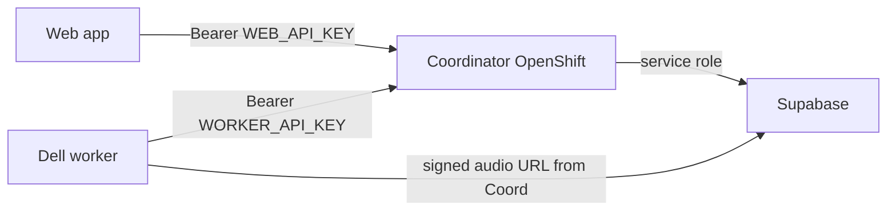

# FireSight Coordinator

OpenShift-deployable BFF/orchestrator between the FireSight web app, Supabase, and the Dell inference worker. The coordinator owns authentication, job lifecycle, and audit boundaries; Supabase remains private backend storage.

## Architecture



## Local development

```bash
cd firesight-coordinator
python -m venv .venv
source .venv/bin/activate
pip install -r requirements.txt
cp .env.example .env
uvicorn app.main:app --reload --port 8080
```

Default mode uses in-memory storage (`USE_FAKE_STORAGE=true`) — no Supabase required.

## API

| Method | Path | Auth | Description |
|--------|------|------|-------------|
| GET | `/health` | none | Health check |
| POST | `/v1/jobs` | web key | Upload audio + create job |
| GET | `/v1/jobs/{id}` | web key | Get job status and results |
| GET | `/v1/jobs/{id}/events` | web key | SSE status stream |
| POST | `/v1/analyze-interview` | web key | Create interview analysis job |
| POST | `/v1/clean-transcript` | web key | Create transcript-cleanup job (remove interviewer questions) |
| POST | `/v1/analyze-photo` | web key | Upload fire-scene photo + create analysis job |
| GET | `/v1/location-plan` | web key | Geocode an address (OneMap) and return an Annex A location-plan PNG |
| POST | `/v1/worker/claim` | worker key | Claim next pending job |
| GET | `/v1/worker/jobs/{id}/audio` | worker key | Download job audio |
| GET | `/v1/worker/jobs/{id}/image` | worker key | Download job image |
| POST | `/v1/worker/jobs/{id}/transcribe` | worker key | Complete transcription phase |
| POST | `/v1/worker/jobs/{id}/complete-extraction` | worker key | Complete extraction phase |
| POST | `/v1/worker/jobs/{id}/complete-analysis` | worker key | Complete interview analysis |
| POST | `/v1/worker/jobs/{id}/complete-clean-transcript` | worker key | Complete transcript cleanup |
| POST | `/v1/worker/jobs/{id}/complete-photo-analysis` | worker key | Complete photo analysis |
| POST | `/v1/worker/jobs/{id}/fail` | worker key | Mark job failed |

## Example flow (curl)

Create a job (use sample audio from sibling repo `firesight-nim-worker/Stop_message_sample.wav`):

```bash
curl -X POST http://localhost:8080/v1/jobs \
  -H "Authorization: Bearer dev-web-key" \
  -F "file=@../firesight-nim-worker/Stop_message_sample.wav" \
  -F "message_type=stop_message" \
  -F "incident_type_name=False Alarm Malfunction"
```

Worker claims the job:

```bash
curl -X POST http://localhost:8080/v1/worker/claim \
  -H "Authorization: Bearer dev-worker-key"
```

Worker completes the job:

```bash
JOB_ID="<id-from-create>"
curl -X POST "http://localhost:8080/v1/worker/jobs/${JOB_ID}/complete" \
  -H "Authorization: Bearer dev-worker-key" \
  -H "Content-Type: application/json" \
  -d '{
    "transcript": "LF812 stop for location at 7 Gul Ave.",
    "result": {
      "fields": {
        "applianceCallSign": "LF812",
        "locationOfFire": "7 Gul Ave",
        "fireInvolved": "",
        "methodOfExtinguishment": "",
        "damagesSustained": "",
        "probableCause": "",
        "ignitionSource": "",
        "ignitionFuel": "",
        "eventsCircumstances": "",
        "areaOfFireOrigin": "",
        "classification": "",
        "handoverOfficer": "",
        "handoverNpc": ""
      },
      "confidence": {
        "applianceCallSign": 0.95,
        "locationOfFire": 0.9,
        "fireInvolved": 0.0,
        "methodOfExtinguishment": 0.0,
        "damagesSustained": 0.0,
        "probableCause": 0.0,
        "ignitionSource": 0.0,
        "ignitionFuel": 0.0,
        "eventsCircumstances": 0.0,
        "areaOfFireOrigin": 0.0,
        "classification": 0.0,
        "handoverOfficer": 0.0,
        "handoverNpc": 0.0
      },
      "source": "fake"
    }
  }'
```

Poll job status:

```bash
curl http://localhost:8080/v1/jobs/${JOB_ID} \
  -H "Authorization: Bearer dev-web-key"
```

## Tests

```bash
pytest -q
```

## OpenShift deployment

Build and push the image, then create secrets and apply manifests:

```bash
docker build -t firesight-coordinator:latest .

oc create secret generic firesight-coordinator-secrets \
  --from-literal=WEB_API_KEY='...' \
  --from-literal=WORKER_API_KEY='...' \
  --from-literal=SUPABASE_URL='...' \
  --from-literal=SUPABASE_SERVICE_ROLE_KEY='...' \
  --from-literal=ONEMAP_EMAIL='...' \
  --from-literal=ONEMAP_PASSWORD='...' \
  --from-literal=COORDINATOR_BASE_URL='https://firesight-coordinator.example.com' \
  --from-literal=CORS_ORIGINS='https://firesight.example.com'

oc apply -f openshift/
```

## Supabase schema

Reference migration: [`supabase/migrations/001_inference_jobs.sql`](supabase/migrations/001_inference_jobs.sql)

Apply manually in your Supabase project when wiring real storage. Set `USE_FAKE_STORAGE=false` and provide `SUPABASE_URL` + `SUPABASE_SERVICE_ROLE_KEY`.

RLS policies should be added before any direct client access; the coordinator uses the service role and enforces auth at the API layer.

## Next phases

- Wire Dell inference worker poller to `/v1/worker/*`
- Integrate Fire Report web app (audio upload + SSE/polling)
- Implement Supabase storage backend
- SSO/OIDC for web routes
- Audit log table and retention policies
